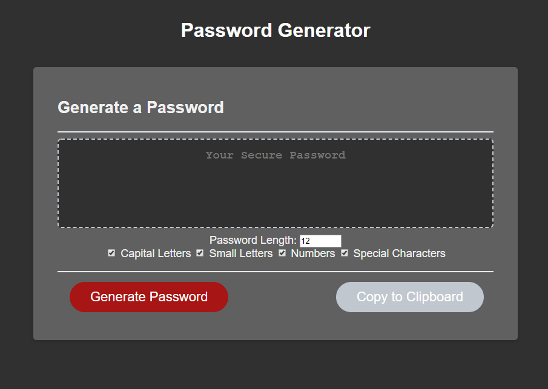
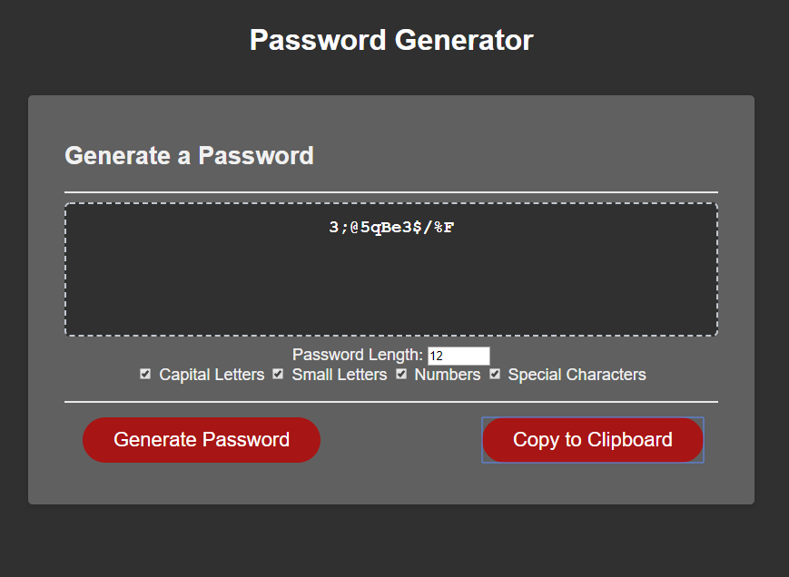

# Week 3 Homework: Password Generator
## Purpose
This exercise is mainly meant to show mastery of basic Javascript methods, variable manipulation, use of library functions, &c.  
Ostensibly this application is meant to be a quick-and-dirty password generator. Anybody with even a lick of sense should realize that this is a student project, it does not use a cryptography-quality pseudo-random number generator for its randomness, and should not be relied on for generating actual passwords that control authentication to anything you care about even a tiny bit. I'll be coming back to this project and adding in APIs for using a proper CPRNG, salted with truly random numbers obtained from [random.org](https://random.org).  

If you want to see it in action, go [here](https://auretus.github.io/week-3-password-generator/). Github repo is [here](https://github.com/auretus/week-3-password-generator/).

Here's a couple of screenshots of it in action:  
  
